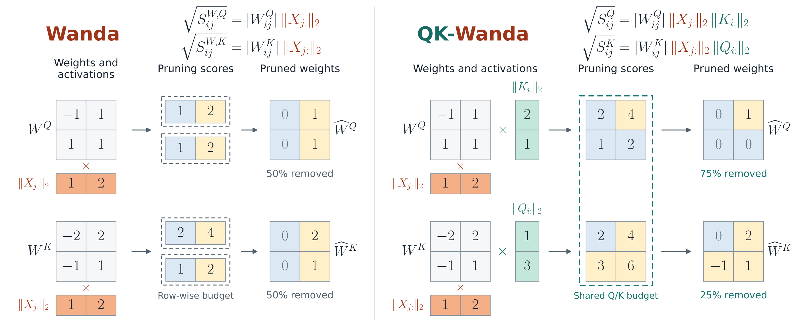

# QK-Wanda

**Coupling queries and keys for unstructured pruning.**

QK-Wanda scores a weight by the change that deleting it alone causes in query–key products. The default objective keeps causally allowed token pairs and uses activations before rotary position embeddings (RoPE). Query and key scores therefore share a common scale, allowing one pruning budget across both projections in each transformer block.

The method needs calibration forward passes, but no gradients, retraining, or updates to retained weights. This repository provides the pruning implementation, Wanda baselines, perplexity evaluation, portable masks, and offline tests.

[Paper](#paper) · [Installation](#install) · [Citation](#citation)



**Wanda vs. QK-Wanda.** In this simplified unmasked example, green factors add query–key interactions to Wanda's input factors (orange). Both methods remove 50% of Q/K weights; QK-Wanda can distribute those removals between Q and K. Multiplication is elementwise with row/column broadcasting.

## Paper

**QK-Wanda: Coupling Queries and Keys for Unstructured Pruning**  
Ivan Ilin and Peter Richtárik.

**arXiv:** *Link to be added.*
<!-- When the arXiv ID is available, replace the line above with the paper link
     and add archivePrefix, eprint, and url to the BibTeX entry below. -->

## Install

Python **3.10 or newer** is required; Python 3.11 is a good starting point. Install a [PyTorch build appropriate for your CPU or CUDA version](https://pytorch.org/get-started/locally/), then:

```bash
git clone https://github.com/vectozavr/qk-wanda.git
cd qk-wanda
python -m venv .venv
source .venv/bin/activate
python -m pip install --upgrade pip
# Install PyTorch in this environment before the next command if using CUDA.
python -m pip install -e '.[data,dev]'
```

The package supports Transformers **4.x, starting at 4.45.2**. See [model support](docs/model-support.md) for tested versions and supported layouts. For a minimal installation using local token arrays, omit the extras: `pip install -e .`.

## Quick start: pretrained Qwen2.5-0.5B on CPU

```bash
qk-wanda prune \
  --model Qwen/Qwen2.5-0.5B \
  --device cpu --dtype float32 \
  --output runs/qwen-0.5b-cpu \
  --sparsity 0.5 --calibration wikitext2 \
  --nsamples 16 --seqlen 64 --save-calibration \
  --eval --eval-seqlen 256 --eval-max-sequences 4
```

This downloads the pretrained [Qwen2.5-0.5B weights](https://huggingface.co/Qwen/Qwen2.5-0.5B) and WikiText-2, calibrates on 16 training sequences of 64 tokens, and removes 50% of the combined Q/K weights in each block. It compares dense and pruned perplexity on the same four 256-token test sequences and saves the masks, calibration token IDs, and results to `runs/qwen-0.5b-cpu/`.

**To use another supported model, change `--model` to its Hugging Face ID or local checkpoint path.** Use `--device cuda:0` for GPU execution or omit `--device` and `--dtype` for automatic selection. Add `--save-model` to save the pruned checkpoint.

The first run needs an internet connection; later runs reuse the Hugging Face cache. Allow several GB of RAM for this FP32 CPU example. Its small calibration and evaluation samples keep the experiment short; use [the reproduction guide](docs/reproduction.md) for full benchmark settings.

**Sparsity refers to Q/K weights by default.** At 50%, half of the combined Q/K parameters in each block are selected for deletion; V/O, MLPs, biases, embeddings, and the output head stay unchanged. In GQA, Q is larger than K, so the two per-projection removal percentages need not average to 50%.

### Outputs

| File | Contents |
| --- | --- |
| `report.json` | Configuration, software versions, calibration provenance and token hash, per-block removal counts, and optional dense/pruned PPL |
| `masks.npz` | Bit-packed Boolean deletion masks; no model weights |
| `calibration.npy` | Exact calibration token IDs, when `--save-calibration` is set |
| `model/` | Standard Hugging Face checkpoint and tokenizer, when `--save-model` is set |

The output directory must be new or empty. Token IDs can reconstruct calibration text, so keep private calibration files out of a public repository. A saved sparse model uses ordinary dense tensors containing zeros; it does not automatically use less storage or a faster inference kernel.

## Supported models

| Hugging Face model type | Examples | Attention |
| --- | --- | --- |
| `llama` | Llama 2, Llama 3/3.1/3.2, TinyLlama | MHA / GQA |
| `qwen2` | Qwen2, Qwen2.5 | GQA, including projection biases |
| `mistral` | Mistral decoder models with separate Q/K projections | GQA |
| `opt` | OPT | MHA, including projected embedding dimensions |

The integration tests exercise real Hugging Face model classes with small configurations and randomly initialized, untrained weights. Mistral and OPT are software-supported extensions; they are not claims of additional paper benchmarks. Models with fused QKV projections, Q/K normalization, quantized weights, or custom remote code need a separate adapter. See [model support](docs/model-support.md) before trying a new architecture.

## Methods and budgets

| CLI options | Scoring | Weights competing for deletion |
| --- | --- | --- |
| Default | Causal pre-RoPE QK-Wanda | Q and K together, within each block |
| `--budget separate` | QK-Wanda | Each complete Q or K matrix separately |
| `--budget row` | QK-Wanda | Each output row separately |
| `--method wanda` | Wanda | Each output row separately |
| `--method wanda --budget separate` | Wanda | Each complete Q or K matrix separately |

Shared Q/K budgets are offered for QK-Wanda because its scores measure the same reconstruction objective. The implementation does not pool Wanda scores across Q and K.

Both methods use `ceil(sparsity × pool_size)` deletions per budget pool by default. Set `--rounding floor` to use the original Wanda integer convention. Equal scores use deterministic row-major ordering; shared-pool ties place Q before K. For matched comparisons, reuse the same calibration file and rounding convention:

```bash
qk-wanda prune --model Qwen/Qwen2.5-0.5B \
  --calibration-tokens runs/qwen-0.5b-cpu/calibration.npy \
  --method wanda --output runs/qwen-0.5b-wanda --eval --eval-max-sequences 16

qk-wanda prune --model Qwen/Qwen2.5-0.5B \
  --calibration-tokens runs/qwen-0.5b-cpu/calibration.npy \
  --method wanda --budget separate \
  --output runs/qwen-0.5b-wanda-matrix --eval --eval-max-sequences 16
```

Other experiments:

- `--variant unmasked`: remove the causal token-pair restriction.
- `--variant rope`: include the model's actual RoPE rotations in the causal score; unavailable for OPT.
- `--scope block`: use QK-Wanda on Q/K and row-wise Wanda on V/O and the MLP projections. With `--method wanda`, use Wanda throughout. Embeddings, biases, normalization, and the output head remain dense.

## Evaluate or reload

If you used `--save-model`, evaluate the saved checkpoint on the full WikiText-2 test stream using complete 2048-token windows:

```bash
qk-wanda evaluate --model runs/qwen-0.5b-cpu/model
```

Or replay masks on the **same original checkpoint and revision** without saving a second full model:

```bash
qk-wanda evaluate --model Qwen/Qwen2.5-0.5B \
  --masks runs/qwen-0.5b-cpu/masks.npz
```

Use `--eval-dataset c4 --eval-max-sequences 256` for the C4 protocol in the reproduction guide. Use `--eval-text path/to/evaluation.txt` for your own evaluation text. Evaluation uses each window's next-token loss, excludes incomplete trailing windows, and projects logits in token chunks to limit memory usage. This is a fixed-window PPL protocol, not overlapping sliding-window evaluation.

Saved checkpoints also work with the [Language Model Evaluation Harness](https://github.com/EleutherAI/lm-evaluation-harness). See the reproduction guide for zero-shot task commands.

## Python API

```python
import torch
from transformers import AutoModelForCausalLM
from qk_wanda import MaskArchive, apply_masks, prune_model

model = AutoModelForCausalLM.from_pretrained("Qwen/Qwen2.5-0.5B", torch_dtype=torch.float32).eval()

# Integer tensor [N, T]: fixed-length independent sequences, without padding.
import numpy as np

tokens = torch.from_numpy(np.load("runs/qwen-0.5b-cpu/calibration.npy"))
archive = MaskArchive()
report = prune_model(model, tokens, sparsity=0.5, mask_callback=archive)
archive.save("masks.npz")
model.save_pretrained("pruned-model", safe_serialization=True)

# On a fresh copy of the same original model: apply_masks(fresh_model, "masks.npz")
```

`prune_model` changes the supplied model in place. It selects both Q/K masks before applying either, then passes the pruned block's output to the next block. The [algorithm notes](docs/algorithm.md) describe the score and normalization conventions.

## Practical notes

- **Memory:** model weights must remain resident on CPU/GPU; complete blocks may be distributed across GPUs. Disk/CPU weight offloading through Accelerate is unsupported. Calibration hidden states are stored on CPU by default, in two buffers of approximately `N × T × hidden_size × bytes_per_element` each.
- **GPU sorting memory:** `--cpu-mask-sort` moves stable sorting to CPU. It needs additional RAM and transfer time.
- **Calibration:** `--calibration-text file.txt` samples one document per nonempty line. Alternatively, provide an integer `[N, T]` `.npy` with `--calibration-tokens`. No padding or cross-sequence attention is introduced.
- **Numerics:** scoring accumulates in FP32. For models producing nonfinite FP16 activations, use `--dtype bfloat16` or `float32`. Device, dtype, library version, and calibration changes may change masks.
- **Reproducibility:** pin `--revision`, save calibration IDs, and keep `report.json` with the masks. Smaller local reconstruction loss does not guarantee better downstream quality.

## Repository layout

```text
src/qk_wanda/     scoring, masks, model adapters, pruning, data, evaluation, CLI
tests/           mathematical oracles and offline model/CLI integration tests
docs/            algorithm conventions, supported models, reproduction commands
examples/        shell script for matched scoring/allocation comparisons
assets/          README illustration in JPG format
```

## Development tests

```bash
pytest -q
```

The automated tests use tiny untrained model fixtures so they run offline and quickly. They check the mathematics and model integrations; the quick-start example above uses pretrained weights and real text.

## Citation

If you use QK-Wanda in your work, please cite the accompanying paper:

```bibtex
@misc{ilin2026qkwanda,
  title  = {{QK-Wanda}: Coupling Queries and Keys for Unstructured Pruning},
  author = {Ilin, Ivan and Richt{\'a}rik, Peter},
  year   = {2026}
}
```

See [CITATION.cff](CITATION.cff) for a software citation.

## Credits

This implementation builds on [Wanda](https://github.com/locuslab/wanda) and its blockwise pruning workflow, which in turn builds on [SparseGPT](https://github.com/IST-DASLab/sparsegpt). The original copyright notice is retained in [LICENSE](LICENSE); see [NOTICE](NOTICE) for attribution.
